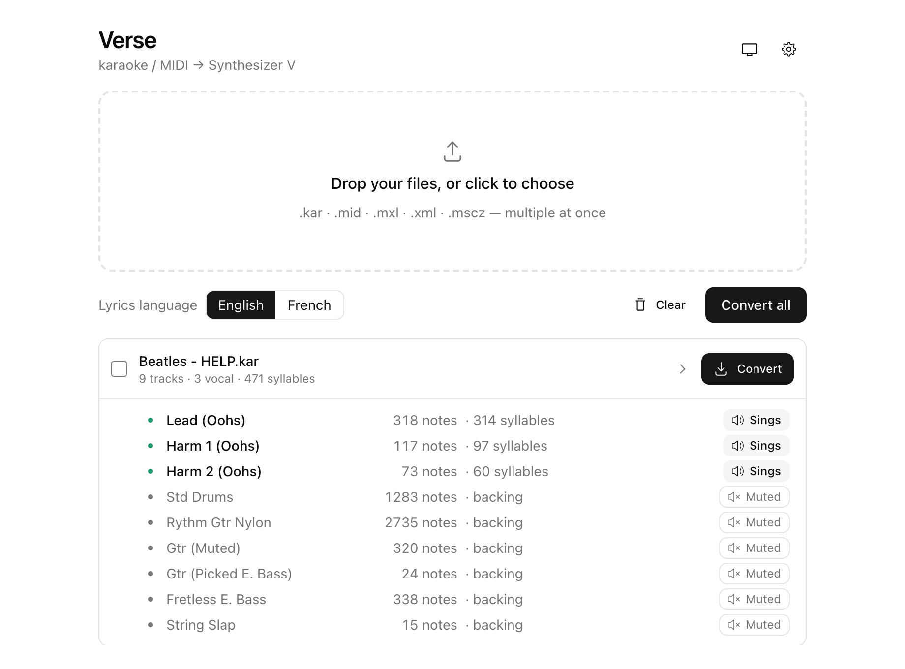

# Verse

A desktop application (macOS / Windows) that converts karaoke, MIDI and score
files into **Synthesizer V** projects (`.svp`) with the real lyrics placed on
the notes, track by track.



## Why this exists

**Synthesizer V Studio 1.x cannot import lyrics from MIDI files.** When you
open a karaoke MIDI (`.kar`) that contains the full lyrics, every note arrives
as "la la la" and you have to retype the whole song syllable by syllable —
hours of tedious work per song.

Dreamtonics fixed MIDI lyric import in **Synthesizer V Studio 2** (2025), but
many users hold perpetual 1.x licenses (this project was born on **1.11.2**)
and cannot upgrade. General-purpose converters either drop the lyrics or, in
some configurations, mangle Western lyrics through a Japanese phonetic cleanup.

Verse fills that gap: it reads the lyrics that are already inside your files
and produces a ready-to-open `.svp` project. Lyrics are copied verbatim — there
is no phonetic conversion of any kind.

## Supported input formats

| Format | Extensions | Notes |
|---|---|---|
| Karaoke MIDI | `.kar` | both lyric storages (lyric meta events and `@`-tag text events) |
| Standard MIDI | `.mid`, `.midi` | |
| MusicXML | `.mxl`, `.xml`, `.musicxml` | multiple voices, repeats and verses unrolled |
| MuseScore | `.mscz`, `.mscx` | MuseScore 3 and 4, no intermediate export needed |

## What the conversion does

- **Multi-track**: the `.svp` reproduces every track of the source file.
  Singing tracks receive their lyrics and are placed first; backing tracks are
  kept, muted by default.
- **Voice detection**: a track sings if it carries most of the song text (lead
  voice) or if most of its own notes land on syllables (harmonies and choirs).
  A track that carries its own aligned lyrics always sings, whatever its name.
  A per-track **Sings / Muted** toggle gives you the final say.
- **Score structure unrolled**: repeat barlines, voltas (1st/2nd endings),
  D.S. / D.C. (al Fine, al Coda), Segno, To Coda and Fine are played out in
  real order — pass k sings verse k.
- **No sung melody?** If a file contains lyrics but no vocal note track (some
  karaoke files only ship the backing band), Verse creates a "Lyrics" track
  with every syllable at the right time on a flat pitch, ready to be melodized
  in Synthesizer V. The tedious part — typing the words — is already done.
- **Languages**: English and French lyric handling. The singing language is
  pre-set in the project file.

## Usage

1. Download the latest release for your platform from the
   [Releases page](https://github.com/JoPadOfficiel/verse-convert-synth-v/releases)
   (`.dmg` for macOS, `.exe` / `.msi` for Windows).
2. Launch Verse and drop your files (several at once), or click to browse.
3. Click a row to inspect the detected tracks; use the Sings / Muted toggle to
   override the detection if needed.
4. Convert all, or select specific files and download the selection. A
   `<name>_LYRICS.svp` file is written next to each source file (or to the
   folder chosen in Settings).
5. In Synthesizer V, use **File > Open** (not Import) on the `.svp`, then
   assign a voice database to each singing track.

### Opening an unsigned build

The released binaries are not code-signed with a paid developer certificate,
so the operating system asks for a one-time confirmation. (Building from source
yourself produces a local, non-quarantined app, which is why it opens without
any prompt.)

**macOS**

- Recommended: **right-click (Control-click) the app > Open**, then click
  **Open** in the dialog. This works even when the plain double-click is
  blocked, and only needs to be done once.
- If macOS still refuses: open **System Settings > Privacy & Security**, scroll
  to the **Security** section, and click **Open Anyway** next to Verse. This
  button only appears right *after* a blocked launch attempt (and stays for
  about an hour), so try to open the app first.
- Terminal alternative (removes the quarantine flag):
  `xattr -dr com.apple.quarantine /Applications/Verse.app`

**Windows**

- On the SmartScreen dialog, click **More info > Run anyway**.

## Development

Prerequisites: Rust (stable) and Node.js 18+.

```
npm install
npm run tauri dev      # run in development
npm run tauri build    # native package (.app/.dmg on macOS, .msi/.exe on Windows)
cargo test             # engine tests (run from src-tauri/)
```

### Architecture

- `src-tauri/src/engine/` — the conversion engine, pure Rust with no runtime
  network dependency: built-in parsers for MIDI (`midi.rs`), MusicXML
  (`musicxml.rs`) and native MuseScore (`musescore.rs`), score unrolling
  (`unroll`), track classification and `.svp` serialization (`convert.rs`,
  `svp.rs`).
- `src-tauri/src/lib.rs` — the Tauri command layer (file validation, size
  caps, per-track overrides).
- `src/` — React + shadcn/ui front end (light/dark theme, batch conversion,
  track detail with toggles, settings).

The `.svp` format is JSON (version 113). Time is expressed in blicks:
one quarter note = 705,600,000 blicks.

Note: song-based test fixtures are not committed (copyrighted material); the
corresponding tests skip automatically when fixtures are absent, while the
score-structure tests always run.

## License

[MIT](LICENSE)
