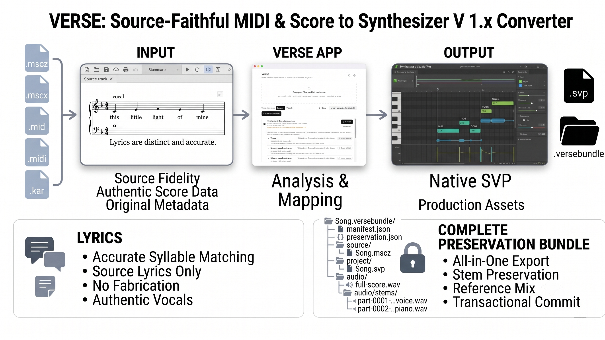

# Verse

Verse is a desktop application for macOS and Windows that converts karaoke,
MIDI and score files into Synthesizer V projects without inventing lyrics or
notes. Linux packages are built for release qualification but are not yet an
officially supported user platform. A complete export keeps the original file,
renders one real audio stem per note-bearing source score Part, and retains a
muted full-score reference mix.



## Why this exists

Synthesizer V Studio 1.x does not reliably import lyrics from MIDI. Depending
on the import/conversion path, users can end up with `la la la`, altered
Western text, missing lyrics or instrumental notes represented as silent vocal
tracks.

Verse uses only evidence present in the source:

- a genuine source lyric such as `la` remains `la`;
- an untexted note remains untexted;
- generic MIDI Text is metadata, not a lyric;
- a normal MIDI file without lyrics succeeds with zero generated words;
- no fallback pitch, lyric, track, instrument or audio is fabricated.

## Supported input formats

| Format | Extensions | Notes |
| --- | --- | --- |
| Karaoke MIDI | `.kar` | Qualified Soft Karaoke text and MIDI lyric events |
| Standard MIDI | `.mid`, `.midi` | Lyric-free MIDI is valid |
| MusicXML | `.mxl`, `.xml`, `.musicxml` | Parts, voices, lyric lanes and unpitched percussion are inventoried |
| MuseScore | `.mscz`, `.mscx` | Native MuseScore score parsing |

## Complete preservation bundle

The primary export is a new `.versebundle` directory:

```text
Song.versebundle/
├── manifest.json
├── preservation.json
├── source/
│   └── Song.mscz
├── project/
│   └── Song.svp
└── audio/
    ├── full-score.wav
    └── stems/
        ├── part-0001-…-voice.wav
        └── part-0002-…-piano.wav
```

- `source/` contains a byte-identical copy of the input.
- `preservation.json` records the disposition of inventoried source items.
- `manifest.json` contains hashes, sizes, renderer identity, source ownership,
  exact Part coverage and audio metadata.
- `project/*.svp` contains only evidence-backed vocal-note projections plus
  real, audio-backed instrumental tracks.
- `audio/stems/*.wav` contains one source-owned stem per note-bearing MuseScore
  Part. Technical chord lanes stay grouped inside their Part.
- `audio/full-score.wav` is rendered from the original file by MuseScore
  Studio and retained as a muted reference track.

The bundle is staged and committed transactionally. Verse never silently
falls back to a mixed-only or audio-less bundle and never overwrites an
existing bundle. Publication fails and rolls back if a required Part stem,
hash, WAV header or SVP reference is missing or inconsistent.

“Source-faithful” means that the original bytes and a disposition ledger are
preserved. It does not mean every notation or MIDI concept has a lossless SVP
equivalent.

## Audio renderer and important limits

Complete bundle export requires **one** user-installed **MuseScore Studio
3.6.2+ or 4.x** executable whose `--score-parts` capability passes Verse's
probe. You do not need to install both major versions. Install the
[current MuseScore Studio 4 release](https://musescore.org/en/download) or the
[official MuseScore 3.6.2 release](https://github.com/musescore/MuseScore/releases/tag/v3.6.2),
then configure its executable in Settings or let Verse try to detect it.
MuseScore is not bundled with Verse. Analysis and the secondary vocal-only
`.svp` export do not need MuseScore; complete bundles do. A native MuseScore 4
score requires a MuseScore 4 renderer. MuseScore 4 can render older MuseScore
sources; MuseScore 3 cannot render a native MuseScore 4 source. Unknown major
versions are rejected until their CLI contract is qualified.

Common executable locations are:

- macOS 4: `/Applications/MuseScore 4.app/Contents/MacOS/mscore` or
  `/Applications/MuseScore Studio 4.app/Contents/MacOS/mscore`;
- macOS 3: `/Applications/MuseScore 3.app/Contents/MacOS/mscore`;
- Windows 4: `C:\Program Files\MuseScore 4\bin\MuseScore4.exe` or the
  equivalent `MuseScore Studio 4` installation folder;
- Linux: `mscore4`, `musescore4`, `mscore3`, `musescore3`, `mscore` or
  `musescore` on `PATH`.

MuseScore renders every note-bearing source Part separately and also renders
the original full score. Accompaniment Part stems start active in Synthesizer
V; Parts that own an editable vocal projection start muted to avoid doubling
the singer; the full-score reference always starts muted. These are score-Part
stems, not AI vocal-removal stems. Renderer absence, timeout, invalid output,
incomplete Part coverage or write failure blocks the bundle and leaves no fake
or partial result.

The secondary “Vocals `.svp`” action writes only editable vocal notes. It does
not contain piano or instrumental audio; use the complete bundle when those
parts must be audible.

## Lyrics, tracks and voices

- MusicXML and MuseScore preserve a stable
  Part → staff → voice → projection-lane topology. Chord-member lanes are not
  reported as fake source tracks.
- Soft Karaoke text is accepted only after its karaoke profile is qualified
  and the complete lyric stream has one unique, injective, monotonic melody
  mapping. Ambiguous or partial mappings remain source-only.
- Generic MIDI Text is preserved as metadata.
- Continuation markers are emitted only from source lyric-extension evidence.
- Unpitched percussion and data not representable in SVP remain in the source,
  ledger and Part/full-score audio.
- UTF-8, UTF-16, ISO-8859-1 and Windows-1252 score XML are decoded from their
  declared encoding; unsupported declarations fail explicitly.
- A manual “Vocal SVP” override changes only the requested export
  representation. It does not change the reported source role and does not
  invent or copy words from another track.

Verse stops instead of guessing when Synthesizer V cannot express a source
timing graph exactly. Current explicit failures include time-signature changes
inside a measure and advanced score navigation with nested repeats, multiple
jumps, or ambiguous segno/coda targets. Native MuseScore tie/spanner graphs
remain preserved in the original score and Part/reference audio; MusicXML
start/stop tie chains are merged in the editable vocal projection.

Verse does not embed or select a commercial Synthesizer V voice database.
After opening the project, assign a compatible voice to every vocal track.
Without that assignment Synthesizer V cannot sing the notes. The instrumental
WAV does not need a voice database.

## Usage

1. Install Verse from the
   [Releases page](https://github.com/JoPadOfficiel/verse-convert-synth-v/releases)
   (`.dmg` on macOS, `.exe` or `.msi` on Windows).
   Linux ARM64/x86_64 packages are build-qualified but currently experimental.
2. Install either MuseScore Studio 3.6.2+ or MuseScore Studio 4 if you want
   complete bundles.
3. Drop one or more supported files into Verse.
4. Expand a file to inspect source Parts, staff/voice counts, source roles,
   lyric status, stem state and warnings.
5. Optionally change a Part’s eligible projection lanes with “Vocal SVP”.
6. Click **Complete project** (or **Export all complete projects**) for the
   complete result.
7. Open `project/*.svp` from inside the bundle in Synthesizer V and assign a
   voice database to the vocal tracks.

The selected lyric language configures the Synthesizer V vocal database
language. It never translates, normalizes or phoneticizes source text.

### Opening an unsigned build

Released binaries are not code-signed with paid Apple/Microsoft developer
certificates, so the operating system may ask for one-time confirmation.

**Windows:** on the SmartScreen dialog, select **More info > Run anyway**.

**macOS:** if Gatekeeper reports that Verse is damaged, remove the download
quarantine flag:

```sh
sudo xattr -rd com.apple.quarantine "/Applications/Verse.app"
```

Adjust the path if Verse is installed elsewhere.

## Documentation

Start with the [documentation index](docs/index.md). The maintained project
documentation includes:

- [project overview](docs/project-overview.md) and
  [source tree](docs/source-tree-analysis.md);
- [current architecture](docs/architecture.md) and
  [component inventory](docs/component-inventory.md);
- [format and fidelity rules](docs/formats-and-fidelity.md),
  [bundle schema](docs/bundle-format.md), and
  [Tauri command contracts](docs/tauri-command-contracts.md);
- [MuseScore renderer setup](docs/musescore-renderer.md),
  [development](docs/development-guide.md), and [testing](docs/testing.md);
- [security and limits](docs/security-and-limits.md),
  [troubleshooting](docs/troubleshooting.md), and
  [deployment](docs/deployment-guide.md);
- [contribution rules](docs/contribution-guide.md) and
  [corpus testing/licensing](docs/test-corpora.md).

## Development

Prerequisites:

- Rust stable (CI uses Rust 1.93.0);
- Node.js 20.19+ or 22.12+ (CI uses Node.js 22);
- either MuseScore Studio 3.6.2+ or 4.x for real audio-rendering gates.

```sh
npm ci
npm run version:check
npm test
npm run build
npm run tauri dev

cargo fmt --manifest-path src-tauri/Cargo.toml -- --check
cargo clippy --manifest-path src-tauri/Cargo.toml --all-targets --locked -- -D warnings
cargo test --manifest-path src-tauri/Cargo.toml --locked
```

Optional local gates for the two reported real-world regressions use:

```sh
VERSE_MSCZ_GATE="/path/to/score.mscz" \
VERSE_MXL_GATE="/path/to/score.mxl" \
cargo test \
  --manifest-path src-tauri/Cargo.toml \
  --locked \
  --test source_fidelity
```

The private multi-format regression matrix is opt-in and never committed:

```sh
VERSE_CORPUS_DIR="/path/to/private-corpus" \
cargo test \
  --manifest-path src-tauri/Cargo.toml \
  --locked \
  --test corpus \
  -- \
  --ignored
```

The pinned CC0 OpenScore Lieder runner parses the full vocal-score corpus and
can render a deterministic bounded sample:

```sh
VERSE_MUSESCORE_GATE="/path/to/mscore" \
scripts/run-openscore-corpus.sh --full-parse --render-sample
```

It writes a machine-readable report under `src-tauri/target/corpus-reports/`.
At the pinned commit the corpus contains 1,352 canonical `.mscx` files. The
current gate projects 1,277 exactly, records 75 narrowly classified
source-evidence limitations, and has zero unexpected or render errors.
See [Testing](docs/testing.md) and
[Corpus testing and licensing](docs/test-corpora.md) for the source audit,
rights policy and additional datasets that were evaluated.

### Releases

Release Please maintains synchronized versions and `CHANGELOG.md`, creates a
draft release, and creates its `vMAJOR.MINOR.PATCH` tag before the reusable
six-platform build starts. The build verifies that exact tag/commit pair,
assembles stable asset names and checksums, replaces draft assets
idempotently, and only then publishes.

Repository administrators must enforce immutable/protected `v*` tags in
GitHub. The workflow revalidates the tag immediately before and after
publication, but a repository rule is the atomic protection against an
external force-push during that final API operation.

See the [deployment guide](docs/deployment-guide.md) for the complete CI,
artifact, checksum, platform-support, and unsigned-package contract.

### Architecture

- `src-tauri/src/engine/` parses MIDI, MusicXML and MuseScore into a
  provenance-rich source model and projects evidence-backed vocal material.
- `src-tauri/src/stems.rs` maps each note-bearing source Part to one stable
  audio stem and its default mute policy.
- `src-tauri/src/renderer.rs` probes MuseScore 3/4 capabilities, extracts
  bounded Parts and bounds every render.
- `src-tauri/src/bundle.rs` creates the transactional preservation bundle,
  validates exact Part coverage, WAVs, hashes and SVP references.
- `src-tauri/src/lib.rs` exposes validated Tauri commands and structured
  errors.
- `src/` is the React interface for analysis, renderer settings, overrides and
  bundle/vocal-only export.

The SVP serializer currently targets project format version 113. Time is
expressed in blicks; one quarter note is 705,600,000 blicks.

The tracked [architecture document](docs/architecture.md) describes the
implementation that exists today. The BMAD architecture artifacts under
`_bmad-output/` also contain explicitly labelled convergence targets; do not
mistake those future application/domain seams for already shipped modules.

## License

[MIT](LICENSE)
