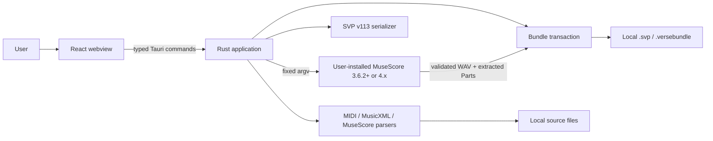
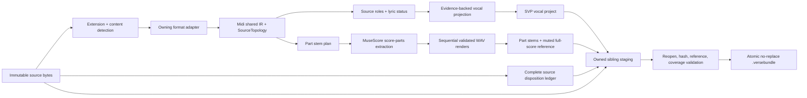

# Verse Architecture

**Status:** Authoritative current architecture and convergence guide  
**Baseline:** `e2a717cd5a0756a089f890478882045dcdf16e7c`  
**Updated:** 2026-07-25

## Design paradigm

Verse is a **modular desktop monolith with a provenance-preserving compiler
pipeline**. The Rust backend owns musical meaning and artifact integrity.
React, Tauri, source formats, MuseScore, Synthesizer V serialization, and the
filesystem are adapters around that core.

There is one deployed application process. GitHub Actions is delivery
infrastructure, not a runtime service. The installed application remains
offline.

## System context



The webview is not a musical domain runtime. It may ask the user to select
files, submit draft overrides, and display results. It does not parse source
files, build manifests, launch processes, or commit output.

## Current module boundaries

| Boundary | Current implementation | Responsibility |
|---|---|---|
| Presentation | `src/App.tsx`, `src/components/` | Transient UI state, selection, dialogs, inspection, exports |
| IPC adapter | `src/lib/tauri.ts`, Tauri commands in `src-tauri/src/lib.rs` | Explicit DTO mapping and command invocation |
| Orchestration | `src-tauri/src/lib.rs` | Input validation, snapshot read, parse/project/export workflow |
| Shared musical model | `engine/midi.rs` | Events, source evidence, topology, timing, repeats/navigation |
| Projection policy | `engine/convert.rs` | Classification, lyric ownership, vocal projection, diagnostics |
| Input adapters | `engine/midi.rs`, `musicxml.rs`, `musescore.rs` | Format-specific parsing into the shared model |
| Target adapter | `engine/svp.rs` | Raw Synthesizer V project v113 serialization |
| Stem policy | `stems.rs` | One stable stem per note-bearing source Part |
| Renderer adapter | `renderer.rs` | MuseScore discovery, capability probe, extraction, render, validation |
| Artifact adapter | `bundle.rs` | Ledger, staged files, integrity checks, no-replace commit |
| Delivery | `.github/workflows/` | Locked tests, multi-platform builds, release publication |

## Conversion pipeline



### Analysis

`convert_files(write=false)` reads each source once, rejects non-regular or
oversized files, detects the correct parser, constructs stable topology,
classifies tracks, projects eligible vocal notes, and returns a `FileResult`.
No MuseScore process is required.

### Vocal-only export

`export_svp` reparses the selected source and applies the explicit track
overrides. It writes only the vocal-note project to a new path. Instrumental
audio is intentionally absent.

### Complete bundle export

`export_bundle` reparses one immutable source snapshot, projects vocals, builds
one `StemPlan`, builds the complete preservation ledger, probes MuseScore,
extracts all score Parts, renders every expected Part and the original full
score, validates all artifacts, and publishes a new bundle transactionally.
There is no mixed-only or audio-less fallback.

## Source model

The current shared type is named `Midi` for historical reasons, but it is used
for MIDI, MusicXML, and MuseScore sources. It contains:

- a source format and exact time base;
- a stable `SourceTopology`;
- ordered source tracks and events;
- raw and decoded lyric/text evidence;
- instruments, channels, programs, controls, percussion information;
- tempo, meter, repeats, voltas, and supported navigation;
- note-source identities and source-owned lyrics.

`SourceTopology` preserves:

```text
SourceTopology
└── SourcePart
    ├── source_track_ids
    └── SourceStaff
        └── SourceVoice
            └── projection_track_ids
```

Projection lanes are technical monophonic lanes required by Synthesizer V.
They do not become fake source Parts or voices. Chord-member lanes stay grouped
inside their original source voice and Part.

## Authority separation

Three concepts must never be conflated:

1. `SourceRole` reports what the source evidence says.
2. `ExportRepresentation` reports how that source is projected.
3. Mixer mute/solo state controls playback only.

A user override changes only the requested export representation. It does not
rewrite source role, copy lyrics from another track, or prove a vocal identity.

## Lyrics and no-invention policy

- A real source `la` remains `la`.
- A missing lyric stays empty; Verse never fills it.
- `-` is emitted only from source continuation/extension evidence.
- Generic MIDI Text is metadata.
- Soft Karaoke Text becomes lyric material only on a locally qualified
  karaoke track and only when the melody binding is unique, complete,
  injective, and monotonic.
- Lyrics remain owned by source track, Part, staff, voice, lyric lane, note,
  and playback occurrence.
- Ambiguous material remains source-only with a diagnostic.
- A lyric-free MIDI is valid and produces zero generated words.

## Rendering architecture

`AudioRenderer` is the inward-facing renderer port;
`MuseScoreRenderer` is its current adapter. The probe:

- accepts only MuseScore 3.6.2+ in the 3.x line or major 4;
- requires a plausible executable name and a real regular file;
- executes `--version` and `--help` under ten-second probe limits;
- requires `--score-parts`;
- hashes the canonical executable and rechecks it around execution;
- rejects MuseScore 3 for native MuseScore 4 scores.

Bundle rendering uses one aggregate twenty-minute deadline, a 2 GiB limit per
WAV, an 8 GiB aggregate audio limit, fixed arguments, bounded logs, a private
working directory, controlled environment variables, process-tree
termination, and strict WAV validation.

On macOS with MuseScore 4, score-loading processes are serialized, separated
by a ten-second cooldown, and retried at most three times only for the known
shutdown `SIGABRT` signature. A score-Parts retry also requires a fully valid
payload. A WAV created by a failed process is removed and never accepted.

See [MuseScore renderer](musescore-renderer.md).

## Persistence and transactions

Verse has no database. Durable data consists of user sources, direct `.svp`
files, and `.versebundle` directories.

Bundle publication follows:

1. reject an existing destination;
2. create a uniquely named sibling staging directory;
3. write a Verse ownership marker;
4. copy the exact source and write project/ledger files;
5. extract and render the required audio;
6. write the manifest;
7. reopen and validate every expected file, hash, size, WAV, coverage set,
   group ID, and relative reference;
8. rename staging to the final destination without replacement.

Cleanup removes only staging whose marker and identity prove Verse ownership.
User files and pre-existing destinations are never deleted.

## Current Tauri contract

The current commands are:

- `convert_files`
- `export_svp`
- `export_bundle`
- `renderer_status`

Rust DTOs use `#[serde(rename_all = "camelCase")]` and are mirrored in
`src/lib/tauri.ts`. Domain errors cross the boundary as a stable uppercase
`code`, human-readable `message`, and optional `remediation`.

The current contract still uses selected path strings and reparses at export
time. Backend-issued handles, immutable plan hashes, cancellable jobs, and
typed progress Channels are **target architecture**, not current behavior.
See [Tauri command contracts](tauri-command-contracts.md).

## Architectural decisions

The following decisions reconcile the BMAD architecture spine with the
implemented source. “Target” means the rule guides future convergence but its
full mechanism is not yet present.

| ID | Decision | Status |
|---|---|---|
| AD-1 | One provenance-preserving compiler pipeline; adapters do not own musical policy | Adopted |
| AD-2 | One application orchestration seam | Partially adopted; orchestration is still in `lib.rs` |
| AD-3 | One canonical source model with topology and performance evidence | Partially adopted through `Midi` + `SourceTopology` |
| AD-4 | Preserve evidence and never invent source facts | Implemented |
| AD-5 | Source classification, export projection, and playback are orthogonal | Implemented |
| AD-6 | Previewed immutable plan is the executed plan | Target; current export reparses and reapplies overrides |
| AD-7 | Stable deterministic IDs, ordering, checked arithmetic, and exact timing | Implemented for current contracts |
| AD-8 | Recoverable typed jobs with bounded concurrency | Target; current UI has one busy guard and exports sequentially |
| AD-9 | Narrow typed and handle-authorized IPC | Typed DTOs implemented; opaque handles are target |
| AD-10 | Capability-bound renderer with no fallback | Implemented for MuseScore 3.6.2+/4.x |
| AD-11 | Transactional no-replace publication | Implemented for `.svp` and bundle outputs |
| AD-12 | Rust owns domain truth; React owns transient UI state | Implemented |
| AD-13 | Persisted contracts have explicit compatibility ownership | Implemented for SVP v113 and bundle/ledger schema v2 |
| AD-14 | One bounded resource policy at trust boundaries | Implemented as explicit constants; central policy object is target |
| AD-15 | Local structured observability without telemetry | Implemented through diagnostics, errors, manifests, and reports |
| AD-16 | Release artifacts require evidence gates | Implemented in CI/release workflows |
| AD-17 | Preserve the locked brownfield stack | Adopted |
| AD-18 | One production parser authority per source family; no production fallback | Implemented |
| AD-19 | Offline local desktop operational envelope | Implemented |

## Dependency and coding rules

- Keep format-specific parsing in its adapter.
- Keep cross-format evidence semantics in `midi.rs`/`convert.rs`.
- Keep SVP serialization in `svp.rs`.
- Keep child-process control in `renderer.rs`.
- Keep filesystem transaction and bundle validation in `bundle.rs`.
- Do not solve format differences with a global nearest-note or cross-track
  heuristic.
- Use stable source order and ordered collections for serialized/audited data.
- Use checked arithmetic and reject unrepresentable timing or pitch.
- Do not accept shell text or arbitrary renderer arguments from the webview.
- Do not make UI behavior depend on English error text.
- Do not add runtime networking, telemetry, or a service tier without an
  explicit product boundary change.

## Stack governance

The current line is Tauri 2, Rust 2021, React 19, TypeScript 5.8, Vite 7, and
Tailwind CSS 4. `package-lock.json` and `Cargo.lock` are authoritative.
Framework upgrades must be isolated compatibility changes, not incidental
feature edits.

## Deferred convergence

These are not missing parts of the current bundle v2 feature:

- extract application use cases from `lib.rs`;
- add backend-owned source/destination handles;
- separate inspection from an immutable, hash-bound conversion plan;
- add typed long-running jobs, progress, cancellation, and startup recovery;
- add Rust-to-TypeScript generated/fixture contract verification;
- qualify blank lyrics, relative audio paths, Unicode, moves, and Save As
  across a supported Synthesizer V 1.x matrix;
- qualify future MuseScore majors through a new capability profile and corpus;
- support advanced navigation, intra-measure meters, native MuseScore tie
  projection, SMPTE projection, or MIDI format 2 only after exact policies and
  regression fixtures exist;
- add signing/notarization only with approved credentials and release policy.

The implemented source topology, conservative KAR lyric binding, Part stems,
bundle schema v2, MuseScore 3/4 profiles, and corpus runner are delivered
architecture, not deferred work.

## Change protocol

An architectural change must:

1. identify the owning boundary and affected decision;
2. preserve or deliberately revise the no-invention and audit contracts;
3. update source, negative tests, public documentation, and persisted-contract
   documentation together;
4. run all mandatory gates and relevant real/corpus gates;
5. update this document only for durable invariants or boundaries, not routine
   file movement.

---

_This document is the Git-tracked reconciliation of the BMAD architecture
spine and the implemented Verse source._
