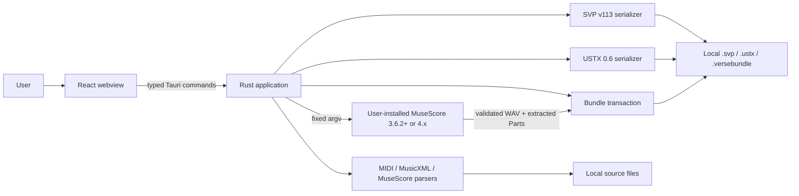
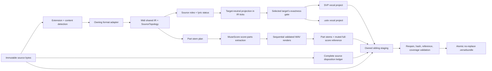

# Verse Architecture

**Status:** Authoritative current architecture and convergence guide  
**Baseline:** `bea4a47` (two export targets)  
**Updated:** 2026-07-28

## Design paradigm

Verse is a **modular desktop monolith with a provenance-preserving compiler
pipeline**. The Rust backend owns musical meaning and artifact integrity.
React, Tauri, source formats, MuseScore, the export-target serializers, and the
filesystem are adapters around that core.

There is one deployed application process. GitHub Actions is delivery
infrastructure, not a runtime service. The installed application remains
offline.

## System context



The webview is not a musical domain runtime. It may ask the user to select
files, submit draft overrides, and display results. It does not parse source
files, build manifests, launch processes, or commit output.

## Current module boundaries

| Boundary | Current implementation | Responsibility |
|---|---|---|
| Presentation | `src/App.tsx`, `src/components/` | Transient UI state, selection, dialogs, inspection, exports |
| IPC adapter | `src/lib/tauri.ts`, Tauri commands in `src-tauri/src/lib.rs` | Explicit DTO mapping and command invocation |
| Orchestration | `src-tauri/src/lib.rs` | Input validation, snapshot read, parse/project/export workflow |
| Shared musical model | `engine/midi.rs` | Events, source evidence, topology, timing, repeats/navigation |
| Projection policy | `engine/convert.rs` | Classification, lyric ownership, vocal projection, diagnostics |
| Input adapters | `engine/midi.rs`, `musicxml.rs`, `musescore.rs` | Format-specific parsing into the shared model |
| Projection seam | `engine/projection.rs` | Target-neutral projection in source-exact IR ticks |
| Target dispatch | `engine/target/mod.rs` | `ExportTarget`, the analysis gate `validate_for`, and the single write boundary `serialize_to` |
| Target adapter | `engine/target/svp.rs` | Raw Synthesizer V project v113 serialization; blicks |
| Target adapter | `engine/target/ustx.rs` | OpenUtau `.ustx` 0.6 serialization; 480 ticks per quarter, and its own deterministic YAML emitter |
| Stem policy | `stems.rs` | One stable stem per note-bearing source Part |
| Renderer adapter | `renderer.rs` | MuseScore discovery, capability probe, extraction, render, validation |
| Artifact adapter | `bundle.rs` | Ledger, staged files, the per-target bundle project and its audio references, integrity checks, no-replace commit |
| Delivery | `.github/workflows/` | Locked tests, multi-platform builds, release publication |

## Conversion pipeline



### Analysis

`convert_files(write=false)` reads each source once, rejects non-regular or
oversized files, detects the correct parser, constructs stable topology,
classifies tracks, projects eligible vocal notes, asks the selected target
whether it can represent the result, and returns a `FileResult`. No MuseScore
process is required.

The exactness gate belongs to analysis, not to export: a refusal the user only
discovered at export would be a refusal the convertibility report had already
cleared. `engine::target::validate_for` therefore runs the selected target's own
arithmetic during analysis and discards the model, so the gate cannot drift from
the write boundary. It is the one place the projection seam is deliberately
one-directional.

One gate answers for everything. Because a bundle now carries the chosen target's
own project, its availability follows that target, so `bundle_ready` equals `ok`.
It was asked of Synthesizer V independently while a bundle could only hold a
`.svp`; keeping that would offer a bundle button for a source the bundle then
refuses, moving the refusal to export time — the failure the gate exists to
prevent. The field is retained for protocol stability, not because the two can
diverge. A source the OpenUtau target refuses reaches a bundle by selecting
Synthesizer V.

### Target abstraction

`ExportTarget` has two variants, `Svp` and `Ustx`, serialized as the stable
lowercase protocol values `"svp"` and `"ustx"`, with Synthesizer V as the
default so a caller naming no target keeps 0.4.9's behaviour.

A target reads `ProjectedProject` and nothing else, so adding one cannot reach
back into the conversion engine or change what another target writes. Everything
a format decides for itself — its time grid, its marker vocabulary, its track
cosmetics, its schema version — lives in its own module. Conversely,
`projection.rs` holds no blicks, no colours, no display order and no rendered
marker text.

`SerializeError` keeps two arms apart because the Tauri boundary maps them to
different codes: `Unrepresentable` is a target refusing this source and surfaces
as `CONVERSION_FAILED`, while `Encode` is an encoder fault that says nothing
about the source and surfaces as `SERIALIZE_FAILED`.

### Vocals-only export

`export_svp` reparses the selected source, applies the explicit track overrides,
and writes only the vocal-note project to a new path in the format named by its
`export_target` argument. The argument is optional and defaults to Synthesizer V.
The output extension must match the chosen target. Instrumental audio is
intentionally absent from both formats; a `.ustx` carries `wave_parts: []`.

### Complete bundle export

`export_bundle` reparses one immutable source snapshot, projects vocals, builds
one `StemPlan`, builds the complete preservation ledger, probes MuseScore,
extracts all score Parts, renders every expected Part and the original full
score, validates all artifacts, and publishes a new bundle transactionally.
There is no mixed-only or audio-less fallback.

It takes an `export_target: Option<ExportTarget>` and writes that target's
project into `project/`, referencing the same stems either way — SVP instrumental
tracks in a `.svp`, `wave_parts` in a `.ustx`. `target` remains the destination
path, not a format; the two parameters are independent.

Adding the OpenUtau variant did not change the manifest schema. It stays at
version 2 with every key's name intact, `svpGroupId` and
`alignment.svpBlickOffset` included. `svpGroupId` carries the Synthesizer V group
UUID for a `.svp` and must be the empty string for a `.ustx`, which verification
enforces so no invented identity can slip in.

Bundle verification is forked per target over one shared canonicalisation block,
so both variants prove the same invariants: one project audio reference per stem,
the muted full-score reference, and canonicalised paths confined to the bundle
root. A committed `.ustx` is re-read through a strict reader that accepts only the
layout the emitter writes.

## Source model

The current shared type is named `Midi` for historical reasons, but it is used
for MIDI, MusicXML, and MuseScore sources. It contains:

- a source format and exact time base;
- a stable `SourceTopology`;
- ordered source tracks and events;
- raw and decoded lyric/text evidence;
- instruments, channels, programs, controls, percussion information;
- tempo, meter, repeats, voltas, and supported navigation;
- note-source identities and source-owned lyrics.

`SourceTopology` preserves:

```text
SourceTopology
└── SourcePart
    ├── source_track_ids
    └── SourceStaff
        └── SourceVoice
            └── projection_track_ids
```

Projection lanes are technical monophonic lanes required because a vocal lane is
monophonic in both targets — a Synthesizer V vocal track and an OpenUtau
`voice_part` alike. They do not become fake source Parts or voices. Chord-member
lanes stay grouped inside their original source voice and Part.

Every adapter splits a voice that sounds two notes at once into one lane each,
before this topology is derived, so `projection_track_ids` counts the lanes that
exist. `ProjectedProject::monophony_violation` then proves the result at the
analysis gate, ahead of either target.

## Authority separation

Three concepts must never be conflated:

1. `SourceRole` reports what the source evidence says.
2. `ExportRepresentation` reports how that source is projected.
3. Mixer mute/solo state controls playback only.

A user override changes only the requested export representation. It does not
rewrite source role, copy lyrics from another track, or prove a vocal identity.

## Lyrics and no-invention policy

- A real source `la` remains `la`.
- A missing lyric stays empty; Verse never fills it. In a `.ustx` that is
  `lyric: ""`, a state no OpenUtau importer can produce.
- A hold marker is emitted only from source continuation/extension evidence, and
  each target spells it in its own vocabulary — `-` for Synthesizer V, `+~` for
  OpenUtau. The projection carries `LyricState`, never rendered marker text, so
  the two vocabularies can never be swapped.
- Generic MIDI Text is metadata.
- Soft Karaoke Text becomes lyric material only on a locally qualified
  karaoke track and only when the melody binding is unique, complete,
  injective, and monotonic.
- Lyrics remain owned by source track, Part, staff, voice, lyric lane, note,
  and playback occurrence.
- Ambiguous material remains source-only with a diagnostic.
- A lyric-free MIDI is valid and produces zero generated words.

## Rendering architecture

`AudioRenderer` is the inward-facing renderer port;
`MuseScoreRenderer` is its current adapter. The probe:

- accepts only MuseScore 3.6.2+ in the 3.x line or major 4;
- requires a plausible executable name and a real regular file;
- executes `--version` and `--help` under ten-second probe limits;
- requires `--score-parts`;
- hashes the canonical executable and rechecks it around execution;
- rejects MuseScore 3 for native MuseScore 4 scores.

Bundle rendering uses one aggregate twenty-minute deadline, a 2 GiB limit per
WAV, an 8 GiB aggregate audio limit, fixed arguments, bounded logs, a private
working directory, controlled environment variables, process-tree
termination, and strict WAV validation.

On macOS with MuseScore 4, score-loading processes are serialized, separated
by a ten-second cooldown, and retried at most three times only for the known
shutdown `SIGABRT` signature. A score-Parts retry also requires a fully valid
payload. A WAV created by a failed process is removed and never accepted.

See [MuseScore renderer](musescore-renderer.md).

## Persistence and transactions

Verse has no database. Durable data consists of user sources, direct `.svp`
files, and `.versebundle` directories.

Bundle publication follows:

1. reject an existing destination;
2. create a uniquely named sibling staging directory;
3. write a Verse ownership marker;
4. copy the exact source and write project/ledger files;
5. extract and render the required audio;
6. write the manifest;
7. reopen and validate every expected file, hash, size, WAV, coverage set,
   group ID, and relative reference;
8. rename staging to the final destination without replacement.

Cleanup removes only staging whose marker and identity prove Verse ownership.
User files and pre-existing destinations are never deleted.

## Current Tauri contract

The current commands are:

- `convert_files`
- `export_svp`
- `export_bundle`
- `renderer_status`

Rust DTOs use `#[serde(rename_all = "camelCase")]` and are mirrored in
`src/lib/tauri.ts`. Domain errors cross the boundary as a stable uppercase
`code`, human-readable `message`, and optional `remediation`.

The current contract still uses selected path strings and reparses at export
time. Backend-issued handles, immutable plan hashes, cancellable jobs, and
typed progress Channels are **target architecture**, not current behavior.
See [Tauri command contracts](tauri-command-contracts.md).

## Architectural decisions

The following decisions reconcile the BMAD architecture spine with the
implemented source. “Target” means the rule guides future convergence but its
full mechanism is not yet present.

| ID | Decision | Status |
|---|---|---|
| AD-1 | One provenance-preserving compiler pipeline; adapters do not own musical policy | Adopted |
| AD-2 | One application orchestration seam | Partially adopted; orchestration is still in `lib.rs` |
| AD-3 | One canonical source model with topology and performance evidence | Partially adopted through `Midi` + `SourceTopology` |
| AD-4 | Preserve evidence and never invent source facts | Implemented |
| AD-5 | Source classification, export projection, and playback are orthogonal | Implemented |
| AD-6 | Previewed immutable plan is the executed plan | Target; current export reparses and reapplies overrides |
| AD-7 | Stable deterministic IDs, ordering, checked arithmetic, and exact timing | Implemented for current contracts |
| AD-8 | Recoverable typed jobs with bounded concurrency | Target; current UI has one busy guard and exports sequentially |
| AD-9 | Narrow typed and handle-authorized IPC | Typed DTOs implemented; opaque handles are target |
| AD-10 | Capability-bound renderer with no fallback | Implemented for MuseScore 3.6.2+/4.x |
| AD-11 | Transactional no-replace publication | Implemented for `.svp`, `.ustx`, and bundle outputs |
| AD-12 | Rust owns domain truth; React owns transient UI state | Implemented |
| AD-13 | Persisted contracts have explicit compatibility ownership | Implemented for SVP v113, USTX 0.6, and bundle/ledger schema v2 |
| AD-14 | One bounded resource policy at trust boundaries | Implemented as explicit constants; central policy object is target |
| AD-15 | Local structured observability without telemetry | Implemented through diagnostics, errors, manifests, and reports |
| AD-16 | Release artifacts require evidence gates | Implemented in CI/release workflows |
| AD-17 | Preserve the locked brownfield stack | Adopted |
| AD-18 | One production parser authority per source family; no production fallback | Implemented |
| AD-19 | Offline local desktop operational envelope | Implemented |
| AD-20 | One target-neutral projection; each export target owns only its own format, and the exactness gate is target-parameterised at analysis time | Implemented for `.svp` and `.ustx` |

## Dependency and coding rules

- Keep format-specific parsing in its adapter.
- Keep cross-format evidence semantics in `midi.rs`/`convert.rs`.
- Keep SVP serialization in `target/svp.rs` and USTX serialization in
  `target/ustx.rs`. Keep everything both targets need out of them and in
  `projection.rs`: no blicks, no ticks-per-quarter, no colours, no display order,
  no rendered marker text.
- Keep target dispatch in `target/mod.rs`. Nothing above the write boundary
  matches on `ExportTarget` except the code that chooses one.
- Cite the OpenUtau source line for every format fact `target/ustx.rs` depends
  on. The facts are read from the `0.1.568` sources, not from documentation.
- Keep child-process control in `renderer.rs`.
- Keep filesystem transaction and bundle validation in `bundle.rs`.
- Do not solve format differences with a global nearest-note or cross-track
  heuristic.
- Use stable source order and ordered collections for serialized/audited data.
- Use checked arithmetic and reject unrepresentable timing or pitch.
- Do not accept shell text or arbitrary renderer arguments from the webview.
- Do not make UI behavior depend on English error text.
- Do not add runtime networking, telemetry, or a service tier without an
  explicit product boundary change.

## Stack governance

The current line is Tauri 2, Rust 2021, React 19, TypeScript 5.8, Vite 7, and
Tailwind CSS 4. `package-lock.json` and `Cargo.lock` are authoritative.
Framework upgrades must be isolated compatibility changes, not incidental
feature edits.

## Deferred convergence

These are not missing parts of the current bundle v2 feature:

- extract application use cases from `lib.rs`;
- add backend-owned source/destination handles;
- separate inspection from an immutable, hash-bound conversion plan;
- add typed long-running jobs, progress, cancellation, and startup recovery;
- add Rust-to-TypeScript generated/fixture contract verification;
- qualify blank lyrics, relative audio paths, Unicode, moves, and Save As
  across a supported Synthesizer V 1.x matrix;
- confirm `lyric: ""` in a running OpenUtau. The representation is reasoned from
  the `0.1.568` sources, not observed;
- open a `.ustx` bundle in OpenUtau and confirm by ear that the stems play. The
  references are written and verified against the manifest and the WAVs, but the
  listening check has not been done;
- qualify future MuseScore majors through a new capability profile and corpus;
- support advanced navigation, intra-measure meters, SMPTE projection, or MIDI
  format 2 only after exact policies and regression fixtures exist. Native
  MuseScore tie projection is shipped and is no longer deferred; the remaining
  narrow case is a tie whose head is written in a later `<voice>` container of
  the same measure;
- add signing/notarization only with approved credentials and release policy.

The implemented source topology, conservative KAR lyric binding, Part stems,
bundle schema v2, MuseScore 3/4 profiles, corpus runner, and the two-target
projection seam are delivered architecture, not deferred work.

## Change protocol

An architectural change must:

1. identify the owning boundary and affected decision;
2. preserve or deliberately revise the no-invention and audit contracts;
3. update source, negative tests, public documentation, and persisted-contract
   documentation together;
4. run all mandatory gates and relevant real/corpus gates;
5. update this document only for durable invariants or boundaries, not routine
   file movement.

---

_This document is the Git-tracked reconciliation of the BMAD architecture
spine and the implemented Verse source._
