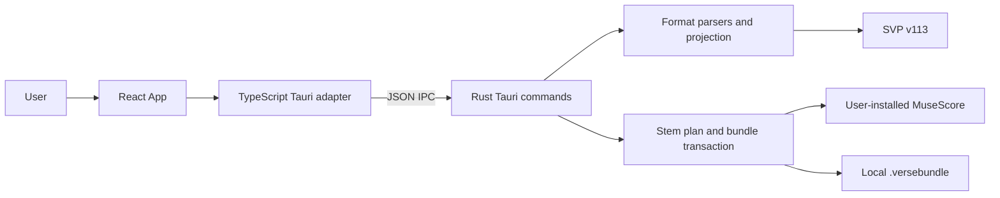

# Verse Component Inventory

**Baseline:** `e2a717cd5a0756a089f890478882045dcdf16e7c`

**Updated:** 2026-07-25

## Runtime composition

Verse is one offline Tauri desktop process. React owns presentation and
transient choices; Rust owns source interpretation, projection, external
processes, artifact validation, and filesystem publication.

There is no router, frontend state library, server, database, account,
telemetry client, or runtime network API.

## React application

| Component | Source | Responsibility | State or dependencies |
|---|---|---|---|
| React entry point | `src/main.tsx` | Mounts React in Strict Mode and installs the theme provider | `ReactDOM`, `ThemeProvider` |
| `App` | `src/App.tsx` | Coordinates selection, analysis, language, renderer status, Part overrides, batch selection, export, and errors | All workflow state is local React state |
| `Dropzone` | `src/components/Dropzone.tsx` | Presents the file-selection button and the accepted extensions | Native selection is delegated to `App`; Tauri webview events handle drag/drop |
| `FileList` | `src/components/FileList.tsx` | Renders file summaries, expandable source Parts, diagnostics, selection, and export actions | Contains private `Row` and `PartRow` presentation components |
| `Settings` | `src/components/Settings.tsx` | Configures appearance, output folder, MuseScore path, and displays renderer status | Uses native directory/executable dialogs |
| `ThemeProvider` | `src/components/theme-provider.tsx` | Resolves light, dark, or system appearance and follows system changes | Persists `verse-theme` in `localStorage` |

`App` uses one `busyRef`/`busy` guard. Only one analysis, reanalysis, or export
workflow may run from the UI at a time. Multi-file bundle exports are
sequential.

### Application state

| State | Lifetime | Meaning |
|---|---|---|
| `items` | Session | Current analysis results |
| `selected` | Session | Sources selected for batch bundle export |
| `overrides` | Session | Explicit per-source, per-track vocal projection choices |
| `language` | Session | Synthesizer V database language, English or French |
| `outDir` | Session | Optional bundle output directory |
| `rendererStatus` | Session | Result of the latest renderer probe |
| `exportErrors`, `globalError` | Session | Structured errors prepared for display |
| `verse.rendererPath` | Persistent local storage | Optional user-selected MuseScore executable |
| `verse-theme` | Persistent local storage | Light, dark, or system theme |

Changing language reanalyzes all current sources. It does not translate,
normalize, or phoneticize source lyrics. A Part-level vocal toggle updates all
of that Part's eligible projection track IDs in one immutable map operation,
reanalyzes the source, and restores the previous map if the command fails.

## Frontend adapters and helpers

| Module | Responsibility |
|---|---|
| `src/lib/tauri.ts` | Mirrors Rust DTOs, opens native dialogs, and invokes the four Tauri commands |
| `src/lib/file-utils.ts` | Defines supported extensions, deduplicates paths, derives default output paths, and normalizes structured command errors |
| `src/lib/vocal-overrides.ts` | Applies one Part choice atomically across its eligible track IDs |
| `src/lib/utils.ts` | Merges conditional Tailwind class names |
| `src/index.css` | Tailwind CSS 4 import, light/dark OKLCH design tokens, and base layout |

The supported source extensions are `.kar`, `.mid`, `.midi`, `.mxl`, `.xml`,
`.musicxml`, `.mscz`, and `.mscx`.

### UI primitives

| Primitive | Status |
|---|---|
| `src/components/ui/button.tsx` | Active reusable button variants |
| `src/components/ui/label.tsx` | Active Radix label wrapper |
| `src/components/ui/card.tsx` | Present but not imported by the current application |
| `src/components/ui/switch.tsx` | Present but not imported by the current application |

`@radix-ui/react-scroll-area` and `@radix-ui/react-select` are installed but
not used. The scaffold assets under `public/` and `src/assets/` are also not
used by the current UI.

## Tauri IPC surface

The TypeScript adapter is `src/lib/tauri.ts`; the Rust adapter is
`src-tauri/src/lib.rs`.

| Command | Frontend use | Rust execution |
|---|---|---|
| `convert_files` | Analyze one or more paths and return Parts, tracks, lyrics, roles, and diagnostics | Synchronous parse and projection; the UI passes `write=false` |
| `export_svp` | Save editable vocal notes to a new `.svp` path | Reparse, project, serialize, and commit without replacement |
| `export_bundle` | Create a complete preservation bundle | Runs on Tauri's blocking pool because it parses, renders, validates, and commits |
| `renderer_status` | Probe configured or auto-detected MuseScore | Runs on the blocking pool and returns available, missing, or unsupported |

Source bytes, the parsed musical model, and WAV data never cross IPC. Rust
DTOs serialize in camelCase and their TypeScript mirrors must change in the
same commit. See [Tauri command contracts](tauri-command-contracts.md).

The native capability file grants the main webview core window operations and
dialog access. The content security policy permits local application
resources and Tauri IPC; it does not authorize arbitrary web connections.

## Rust domain and application modules

| Module | Responsibility |
|---|---|
| `src-tauri/src/main.rs` | Minimal desktop binary entry point |
| `src-tauri/src/lib.rs` | Tauri builder, DTOs, validation, command handlers, and current application orchestration seam |
| `src-tauri/src/engine/midi.rs` | Shared musical/source model, SMF and KAR parsing, exact events, topology, timing, repeats, and navigation |
| `src-tauri/src/engine/musicxml.rs` | MusicXML/XML/MXL decoding into the shared model |
| `src-tauri/src/engine/musescore.rs` | Native MSCX/MSCZ decoding into the shared model |
| `src-tauri/src/engine/convert.rs` | Source classification, lyric ownership, diagnostics, overrides, and evidence-backed vocal projection |
| `src-tauri/src/engine/projection.rs` | Target-neutral projection consumed by every export target |
| `src-tauri/src/engine/target/svp.rs` | Synthesizer V project v113 data model and serialization |
| `src-tauri/src/stems.rs` | Stable one-stem-per-note-bearing-Part plan and default mute policy |
| `src-tauri/src/renderer.rs` | MuseScore discovery, capability probe, Part extraction, bounded rendering, process cleanup, and WAV validation |
| `src-tauri/src/bundle.rs` | Preservation ledger, staging, rendering orchestration, integrity validation, rollback, and no-replace commit |
| `src-tauri/src/bin/corpus_audit.rs` | Standalone pinned public-corpus audit command |

The shared source type is historically named `Midi`, but MusicXML and
MuseScore adapters also populate it. Cross-format policy belongs in the shared
model or `convert.rs`; format-specific syntax belongs in the owning parser.

## External adapters

| Adapter | Direction | Contract |
|---|---|---|
| Tauri dialog plugin | UI to operating system | Select source files, output directory, destination, and renderer executable |
| Local filesystem | Rust to disk | Read immutable source snapshots and publish only to new destinations |
| MuseScore Studio | Rust child process | Fixed `--version`, `--help`, `--score-parts`, and WAV-render commands |
| Synthesizer V Studio | Persisted file consumer | Opens raw SVP project version 113; Verse does not automate or embed Synthesizer V |
| GitHub Actions | Delivery only | Tests and packages releases; it is not a runtime dependency |

MuseScore is optional for analysis and vocal-only export. A complete bundle
requires one compatible MuseScore 3.6.2+ installation in the 3.x line or a
verified MuseScore 4.x installation. See
[MuseScore renderer](musescore-renderer.md).

## Tests and engineering utilities

| Component | Responsibility |
|---|---|
| `tests/frontend-utils.test.mjs` | Extensions, deduplication, output paths, and structured errors |
| `tests/vocal-overrides.test.mjs` | Atomic Part override behavior and callback forwarding |
| `tests/version-check.test.mjs` | Strict changelog version/date parsing |
| `scripts/check-version.mjs` | Synchronizes release version authority across npm, Cargo, Tauri, changelog, and Release Please files |
| `scripts/run-openscore-corpus.sh` | Pins, validates, audits, and optionally renders OpenScore Lieder |
| `src-tauri/tests/source_fidelity.rs` | No-invention and optional real score gates |
| `src-tauri/tests/corpus.rs` | Ignored private multi-format corpus expectations |
| `src-tauri/tests/parity.rs` | Cross-format semantics and private parity fixtures |

The frontend suite does not currently render React components or run an
end-to-end desktop workflow. `npm run build` is the strict TypeScript
compilation gate. There is no configured ESLint or Prettier gate.

## Change ownership

- UI-only behavior belongs in `src/`.
- Musical interpretation belongs in `src-tauri/src/engine/`.
- Renderer process behavior belongs in `renderer.rs`.
- Bundle schema or transaction behavior belongs in `bundle.rs`.
- A Tauri DTO change requires matching Rust and TypeScript changes.
- Persisted contract changes require updates to
  [Bundle format](bundle-format.md) or
  [Tauri command contracts](tauri-command-contracts.md).
- Architectural boundary changes require an update to
  [Architecture](architecture.md).
